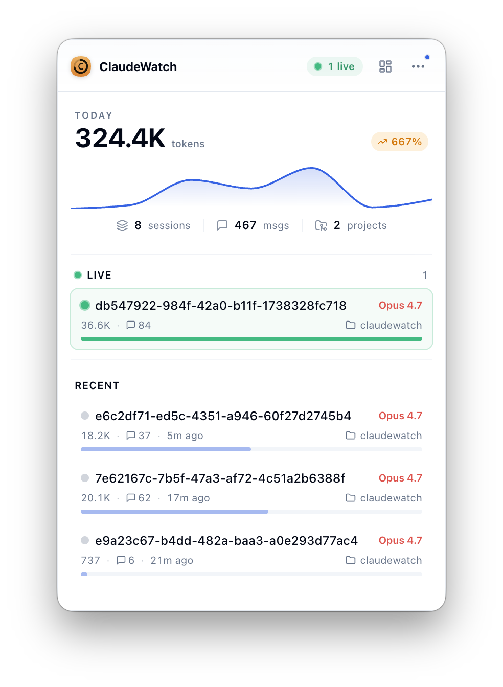
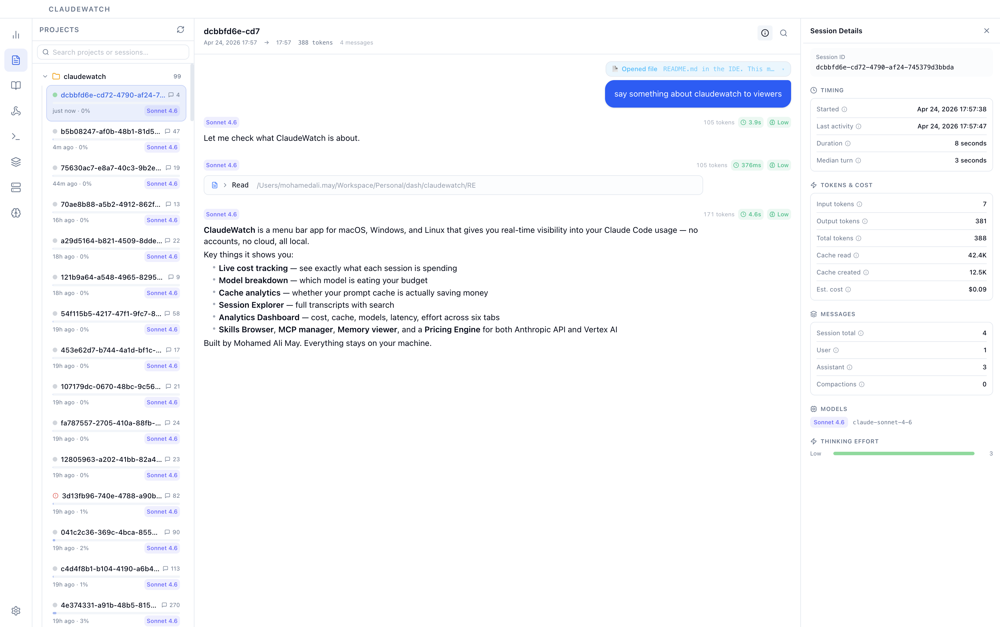
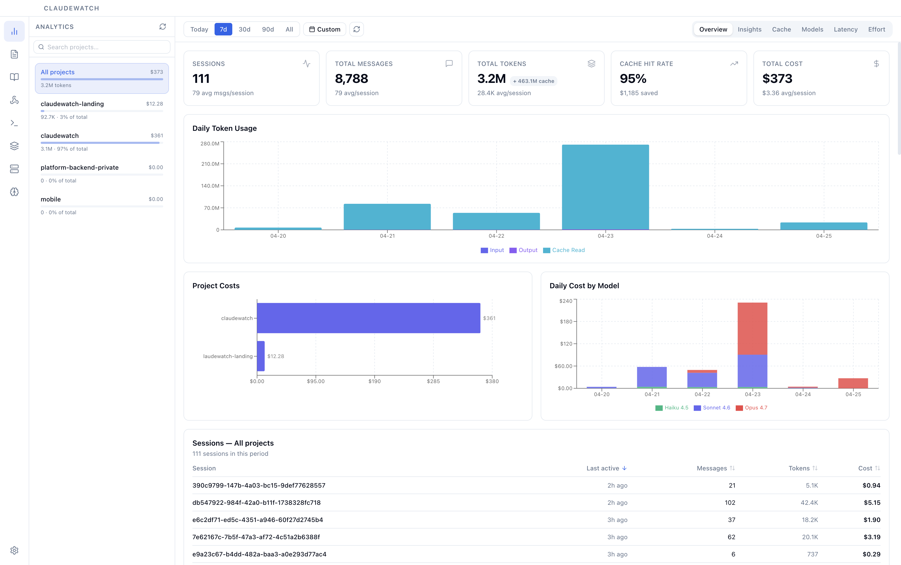
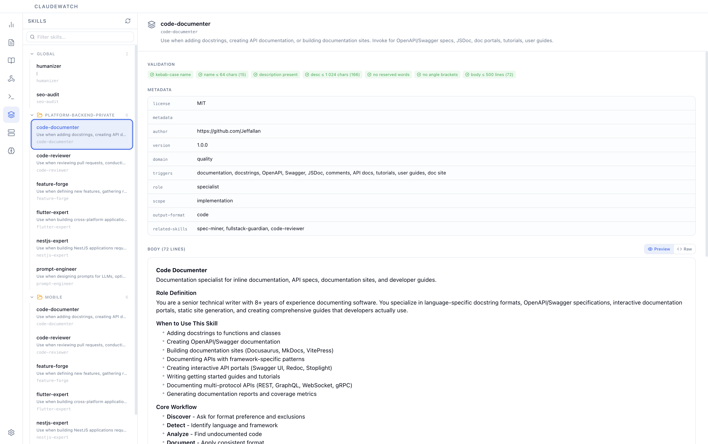
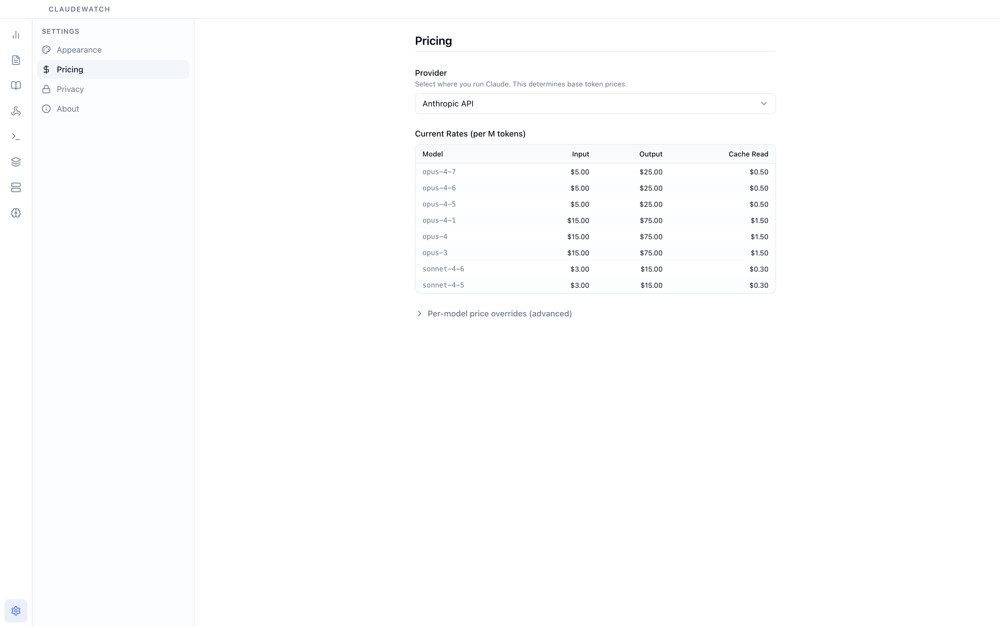

<p align="center">
  
</p>

<h1 align="center">ClaudeWatch</h1>

<p align="center">
  Finally know what Claude Code is actually doing — and what it's costing you.
</p>

<p align="center">
  <a href="https://github.com/maydali28/claudewatch/actions/workflows/release.yml">
    
  </a>
  <a href="https://github.com/maydali28/claudewatch/releases/latest">
    
  </a>
  <a href="https://github.com/maydali28/claudewatch/releases">
    
  </a>
  
  <a href="LICENSE">
    
  </a>
  <a href="https://www.producthunt.com/products/claudewatch-2">
    
  </a>
</p>

---

You use Claude Code every day. But do you know which sessions blew your budget? Which model is eating most of your spend? Whether your prompt cache is actually saving money? ClaudeWatch answers all of that — from your menu bar, in real time, with no accounts, no cloud sync, and no data leaving your machine.

## Screenshots

<p align="center">
  
  <br /><em>Menu bar popover — live stats at a glance</em>
</p>

<p align="center">
  
  <br /><em>Session Explorer — full transcript with search and detail panel</em>
</p>

<p align="center">
  
  <br /><em>Analytics Dashboard — six tabs covering cost, cache, models, latency, and effort</em>
</p>

<p align="center">
  
  <br /><em>Skills — inline validation and markdown preview</em>
</p>

<p align="center">
  
  <br /><em>Pricing Engine — Anthropic API and Vertex AI cost tables</em>
</p>

## Table of Contents

- [How It Works](#how-it-works)
- [Installation](#installation)
- [Requirements](#requirements)
- [Troubleshooting](#troubleshooting)
- [Features](#features)
  - [Menu Bar Popover](#menu-bar-popover)
  - [Session Explorer](#session-explorer)
  - [Analytics Dashboard](#analytics-dashboard)
  - [Hooks](#hooks)
  - [Commands](#commands)
  - [Skills](#skills)
  - [MCPs](#mcps)
  - [Memory](#memory)
  - [Pricing Engine](#pricing-engine)
  - [Auto-Update](#auto-update)
- [Getting Started (Development)](#getting-started-development)
  - [Environment Variables](#environment-variables)
- [Project Structure](#project-structure)
- [Tech Stack](#tech-stack)
- [Available Scripts](#available-scripts)
- [IPC Architecture](#ipc-architecture)
- [Contributing](#contributing)
- [License](#license)

---

## How It Works

ClaudeWatch watches `~/.claude/projects/` using [chokidar](https://github.com/paulmillr/chokidar) for file system events. When Claude Code writes to a session file (JSONL format), ClaudeWatch detects the change, streams the file line-by-line without loading it fully into memory, and updates the UI in real time. There is no polling interval — changes propagate as fast as the OS delivers the event.

On first launch, ClaudeWatch performs a one-time scan to build the project and session index. From that point, only changed files are re-parsed. Cost calculations happen inline at parse time so the analytics view never needs a separate aggregation pass.

The app runs as a standard Electron process. On macOS it appears only in the menu bar (`LSUIElement` equivalent via Electron's `skipTaskbar`). The tray popover is a frameless window pinned to the tray icon; the full dashboard is a separate browser window opened on demand.

---

## Installation

### macOS

> **Note:** The macOS build is not yet Apple-notarized (Developer Program enrollment is in progress). Homebrew strips the quarantine flag automatically, so the recommended path below works out of the box. If you download the `.dmg` directly you will need one extra command — see [Direct download](#direct-download).

#### Homebrew (recommended)

```bash
brew tap maydali28/claudewatch
brew install --cask claudewatch
```

#### Direct download

Download the `.dmg` from the [latest release](https://github.com/maydali28/claudewatch/releases/latest), drag the app to `/Applications`, then run this **once** to clear the macOS quarantine flag:

```bash
xattr -dr com.apple.quarantine /Applications/ClaudeWatch.app
```

Without this step, macOS will refuse to open the app with a "ClaudeWatch is damaged" message because the build is not yet notarized. The Homebrew install path above does this for you automatically.

#### Updating

ClaudeWatch checks for updates on launch and on a periodic interval. When a new version is available, an indicator appears in the tray popover. Clicking "Install Update" downloads the release, verifies it, replaces the binary, and relaunches. No manual steps required.

You can also update via Homebrew:

```bash
brew upgrade --cask claudewatch
```

### Windows

> **Note:** The Windows build is not yet code-signed with a Microsoft-trusted certificate (signing certificate acquisition is in progress). On first launch, Microsoft Defender SmartScreen will show a blue **"Windows protected your PC"** warning. This is expected — the installer is safe, just unsigned.

Download `ClaudeWatch-Setup.exe` from the [latest release](https://github.com/maydali28/claudewatch/releases/latest). When the SmartScreen warning appears, click **More info**, then **Run anyway** to proceed with the install. The installer uses Squirrel, so subsequent updates apply silently in the background and will not show the warning again.

### Linux
#### Debian/Ubuntu (one-liner, recommended)

```bash
curl -fsSL https://maydali28.github.io/claudewatch/install.sh | sudo bash
```

The installer adds the signed APT source, verifies the signing key against a pinned fingerprint, and installs ClaudeWatch. Re-running it upgrades to the latest version. To uninstall:

```bash
curl -fsSL https://maydali28.github.io/claudewatch/install.sh | sudo bash -s -- --uninstall
```

Prefer to audit before running? Download first:

```bash
curl -fsSL https://maydali28.github.io/claudewatch/install.sh -o install.sh
less install.sh    # review
sudo bash install.sh
```

#### Debian/Ubuntu (manual APT setup)

```bash
sudo install -d -m 0755 /etc/apt/keyrings
curl -fsSL https://maydali28.github.io/claudewatch/pubkey.gpg \
  | sudo gpg --dearmor -o /etc/apt/keyrings/claudewatch.gpg
echo "deb [signed-by=/etc/apt/keyrings/claudewatch.gpg] https://maydali28.github.io/claudewatch stable main" \
  | sudo tee /etc/apt/sources.list.d/claudewatch.list
sudo apt update
sudo apt install claudewatch
```

Future updates apply with `sudo apt upgrade`.

#### Direct download

Download the `.deb` (Debian/Ubuntu) or `.rpm` (Fedora/RHEL) from the [latest release](https://github.com/maydali28/claudewatch/releases/latest).

---

## Requirements

- **Claude Code** installed and used at least once (creates `~/.claude/projects/`)
- **macOS** Sonoma 14+ / **Windows** 10+ / **Linux** (glibc 2.28+)
- Node.js 20+ and pnpm 10+ (development only)

---

## Features

### Menu Bar Popover

ClaudeWatch lives in your menu bar — always one click away, never in your way. Click the icon and you get an instant snapshot of your Claude Code activity without switching apps or opening a terminal:

- **Today's cost, tokens, sessions, and projects** — four numbers that update the moment a session file changes
- **Live active session card** — when Claude Code is working right now, you see the project, model, and live token count with a pulsing green indicator
- **Recent sessions** — the last few sessions across all projects with relative timestamps and cost, clickable to jump directly to the full transcript
- **Quick actions** — open the dashboard, check for updates, or quit

### Session Explorer

Every conversation Claude Code has ever had, fully accessible and searchable.

- **Real-time updates** — sessions appear the moment Claude Code writes a new file; no refresh needed
- **Full transcript view** — browse the complete conversation including user messages, assistant responses, thinking blocks, tool calls, file reads, and bash output
- **In-session search** — press `Cmd+F` to find anything inside the open session; collapsed blocks auto-expand on match
- **Global search** — full-text search across every session, every project
- **Session detail panel** — tokens, cost, compaction count, subagent usage, thinking effort distribution, and error flags all in one place
- **Custom tags** — label sessions by feature, client, or sprint; tags persist and are filterable
- **Export** — save any session as **Markdown** or **JSON** with full metadata

### Analytics Dashboard

Six purpose-built analytics tabs, each answering a different question about how you use Claude Code. Every tab shares the same date range picker (Today, 7d, 30d, 90d, All, or custom) and project filter so comparisons are always consistent.

**Overview** — The big picture. KPI cards for sessions, messages, tokens, cache hit rate, and cost. A daily token usage chart, project cost breakdown, and a sessions table sortable by activity, tokens, or cost.

**Insights** — Auto-generated callouts that surface what raw numbers miss: cache efficiency drops, cost concentration, latency anomalies, frequent context compaction, and model dominance. Includes a **What-If Calculator** that estimates how much you would save by switching some Opus usage to Sonnet.

**Cache** — Your prompt cache is supposed to save money. This tab tells you whether it actually is. A hit-ratio gauge, cost savings estimate, daily trend with cache-busting day markers, and a per-session efficiency ranking.

**Models** — Which model is really driving your spend? Turn distribution and cost broken down by model family, a daily cost-by-model trend, and an efficiency table ranked by cost-per-turn.

**Latency** — Slow turns break flow. See the p50, p95, and p99 turn durations, a duration distribution histogram, and a direct comparison of normal turns versus turns after a context compaction.

**Effort** — Not every session is equal. Turn effort is classified into Low, Medium, High, and Ultrathink levels. See where your ultrathink budget goes, cost by effort level, and parallel tool usage distribution.

### Hooks

All your Claude Code hook events in one place — no more digging through config files. Every registered hook is grouped by event type (`PreToolUse`, `PostToolUse`, `PermissionDenied`, `SessionStart`, `Stop`, `UserPromptSubmit`, `Notification`) and displayed with its matcher pattern, the command it runs, and its timeout setting.

### Commands

Every custom slash command you have defined, rendered as markdown exactly as Claude Code sees it. Browse, search, and review your command library without leaving the app.

### Skills

All installed skills — global and per-project — with their full definitions and metadata. ClaudeWatch validates each skill inline and surfaces issues directly next to the skill name: missing descriptions, naming convention violations, reserved words, and body length limits. A Preview / Raw toggle lets you read the skill as rendered markdown or inspect the raw source.

### MCPs

Every Model Context Protocol server configured across global, project, and local settings, with live connection status (connected / failed / unknown). Each entry shows:

- Transport type (stdio / sse / http) and config level (global / project / local)
- Full command, arguments, and masked environment variables
- Active capabilities: Tools, Prompts, Resources — with strikethrough for inactive ones
- Last seen timestamp

### Memory

All CLAUDE.md and memory files that Claude Code uses for persistent context — global, per-project, and auto-memory — browseable in one panel. Each file is rendered as markdown with a raw-text toggle, and shows size and line count so you know exactly how much context you are injecting into every session.

### Pricing Engine

Cost is estimated from the raw token counters stored in each JSONL session file. Three pricing tables are built in:

- **Anthropic API (direct)** — standard published rates including cache creation charges
- **Vertex AI (Global)** — same input/output rates, cache creation is free
- **Vertex AI (Regional)** — 10% surcharge over global rates on input, output, and cache read

The model ID (e.g. `claude-opus-4-6-20250313`) is mapped to a pricing family, with version-aware handling because Opus 4.5+ and Haiku 4.5+ have different rates from their predecessors. Switching pricing provider in settings recalculates all cost estimates across the app immediately.

These are estimates based on published pricing, not actual billed amounts.

### Auto-Update

- macOS: DMG download with signature verification, or `brew upgrade --cask claudewatch`
- Windows: Squirrel auto-update applies silently
- Linux: DEB / RPM manual download from releases

---

## Getting Started (Development)

### 1. Clone and install

```bash
git clone https://github.com/maydali28/claudewatch.git
cd claudewatch
pnpm install
```

### 2. Configure environment variables

```bash
cp .env.example .env.local
```

Open `.env.local` and fill in your values. The file is gitignored — never commit it.

#### Environment Variables

| Variable | Required | Description |
|----------|----------|-------------|
| `MAIN_VITE_SENTRY_DSN` | No | Sentry DSN for crash reports and user feedback. Leave empty to disable Sentry. Get it from your Sentry project under **Settings → Client Keys (DSN)**. |
| `MAIN_VITE_RELEASE_SERVER_URL` | No | Base URL for the auto-updater release feed (Hazel or generic provider). Leave empty to disable update checks. |
| `MAIN_VITE_GITHUB_RELEASES_URL` | No | GitHub releases base URL for fetching and verifying release manifests. |
| `MAIN_VITE_BREW_CASK_NAME` | No | Homebrew cask name used in `brew upgrade --cask <name>` on macOS. |
| `VITE_WEBSITE_URL` | No | Project website URL shown in About panels. |
| `VITE_REPO_URL` | No | GitHub repository URL shown in About panels. |
| `ANALYZE` | No | Set to `true` to open a bundle size visualiser (`bundle/stats.html`) after `pnpm build`. Defaults to `false`. |

`MAIN_VITE_*` variables are loaded by electron-vite and injected into the main process bundle. `VITE_*` variables are injected into the renderer bundle. Both are read from `.env` and `.env.local` automatically — no manual wiring needed.

Variables are baked into the app bundle at build time by `electron-vite`'s `define` — there is no `process.env` access in the shipped binary. The authoritative reference is [`.env.example`](.env.example).

The following secrets must be set in your GitHub repository (**Settings → Secrets and variables → Actions**) and are never stored in `.env` files:

| Secret | Purpose |
|--------|---------|
| `MAIN_VITE_SENTRY_DSN` | Sentry DSN for crash reports |
| `MAIN_VITE_RELEASE_SERVER_URL` | Auto-updater release feed URL |
| `MAIN_VITE_GITHUB_RELEASES_URL` | GitHub releases base URL for manifest verification |
| `VITE_WEBSITE_URL` | Project website URL |
| `VITE_REPO_URL` | GitHub repository URL |
| `HOMEBREW_TAP_TOKEN` | PAT with write access to the Homebrew tap repo |
| `CSC_LINK` | Code-signing certificate (`.p12`) path — macOS/Windows only |
| `CSC_KEY_PASSWORD` | Password for the code-signing certificate |

CI secrets override the defaults baked into `.env` at build time.

### 3. Run in development mode

```bash
pnpm dev
```

This starts the electron-vite dev server with hot reload for both the main process and renderer. The tray icon will appear in your system tray.

---

## Troubleshooting

### macOS

#### "ClaudeWatch is damaged and can't be opened" / "cannot be opened because the developer cannot be verified"

The macOS build is currently **not notarized with Apple**, so on first launch Gatekeeper will quarantine the app and refuse to open it. To remove the quarantine flag, run once after installation:

```bash
xattr -dr com.apple.quarantine /Applications/ClaudeWatch.app
```

Then open the app normally. You only need to do this once per install (and once again after each update if you keep seeing the warning). Notarization is on the roadmap — once it ships, this step will no longer be required.

### Linux

#### `chrome-sandbox` permissions error

On Linux, running `pnpm start` (or `pnpm dev`) may fail with:

```
FATAL:setuid_sandbox_host.cc(166)] The SUID sandbox helper binary was found,
but is not configured correctly.
```

Electron's Chromium sandbox requires the `chrome-sandbox` binary to be owned by root with mode `4755`. After `pnpm install`, fix the permissions once:

```bash
sudo chown root:root node_modules/electron/dist/chrome-sandbox
sudo chmod 4755 node_modules/electron/dist/chrome-sandbox
```

Then run `pnpm start` normally (without `sudo`).

**Do not run `pnpm start` with `sudo`** — Electron refuses to launch as root, and passing `--no-sandbox` to `pnpm start` fails because `electron-vite` rejects unknown CLI options. If you must disable the sandbox (e.g. inside a container or VM where setuid is unavailable), use the env var instead:

```bash
ELECTRON_DISABLE_SANDBOX=1 pnpm start
```

---

## Project Structure

```
claudewatch/
├── src/
│   ├── main/                    # Main process (Node.js / Electron)
│   │   ├── index.ts             # App entry, lifecycle, tray setup
│   │   ├── window-manager.ts    # Dashboard + tray popover windows
│   │   ├── tray-manager.ts      # System tray icon & context menu
│   │   ├── services/            # Core business logic
│   │   │   ├── session-parser.ts      # JSONL streaming parser entry
│   │   │   ├── parsers/               # Metadata / full / subagent parsers
│   │   │   ├── session-search.ts      # Cross-session full-text search
│   │   │   ├── analytics-engine.ts    # Aggregation across sessions
│   │   │   ├── pricing-engine.ts      # Token cost calculations
│   │   │   ├── lint-service.ts        # Rule runner
│   │   │   ├── lint-rules/            # Rule implementations (grouped by prefix)
│   │   │   ├── file-watcher.ts        # chokidar wrapper
│   │   │   ├── project-scanner.ts     # Initial directory scan
│   │   │   ├── config-service.ts      # Config file readers
│   │   │   ├── secret-scanner.ts      # Credential detection
│   │   │   ├── metadata-cache.ts      # Session metadata cache
│   │   │   ├── scan-cache.ts          # Project scan cache
│   │   │   ├── update-service.ts      # GitHub release fetcher
│   │   │   ├── export-service.ts      # Markdown / JSON export
│   │   │   └── sentry.ts              # Sentry init, enable/disable, capture helpers
│   │   ├── ipc/                 # IPC request handlers (domain-split)
│   │   ├── lib/                 # logger, p-limit, safe-path, app-config
│   │   └── store/               # Persistent preferences (electron-store)
│   │
│   ├── renderer/src/            # Renderer process (React)
│   │   ├── app.tsx              # Dashboard entry
│   │   ├── tray-app.tsx         # Tray popover entry
│   │   ├── about-app.tsx        # About window entry
│   │   ├── onboarding-app.tsx   # Onboarding window entry
│   │   ├── update-app.tsx       # Update window entry
│   │   ├── components/
│   │   │   ├── layout/          # Dashboard shell, left rail, panels
│   │   │   ├── sessions/        # Session list + detail views
│   │   │   ├── analytics/       # Charts and insight tabs
│   │   │   ├── config/          # Config file browser
│   │   │   ├── lint/            # Health gauge + rule results
│   │   │   ├── plans/           # Plan browser
│   │   │   ├── timeline/        # Activity timeline
│   │   │   ├── settings/        # Preferences panels
│   │   │   ├── tray-popover/    # Tray window UI
│   │   │   ├── onboarding/      # First-run flow
│   │   │   ├── update/          # Update window UI
│   │   │   ├── about/           # About window UI
│   │   │   ├── shared/          # Cross-feature components
│   │   │   └── ui/              # Radix-based primitives
│   │   ├── hooks/               # Custom React hooks
│   │   └── store/               # Zustand stores
│   │
│   ├── preload/
│   │   └── index.ts             # Context bridge for renderer ↔ main IPC
│   │
│   └── shared/                  # Types and utilities shared across processes
│       ├── types/               # TypeScript interfaces
│       ├── ipc/                 # Channel constants + typed IPC contracts
│       ├── constants/           # Pricing tables, model metadata, lint rule meta
│       └── utils/               # Formatting helpers, date ranges, entropy
│
├── resources/                   # App icons and tray assets
├── scripts/                     # Release, changelog, bundle-size, licenses
├── forge.config.ts              # Electron Forge packaging config
├── electron.vite.config.mts     # electron-vite build config
└── .github/workflows/release.yml
```

---

## Tech Stack

| Layer | Technology |
|-------|-----------|
| Desktop shell | Electron 32 |
| Build tooling | electron-vite 2, electron-forge 7 |
| UI | React 19, TypeScript 5.6, TailwindCSS 4 |
| Components | Radix UI primitives |
| Charts | Recharts 2 |
| State | Zustand 5, TanStack React Query 5 |
| Persistence | electron-store 8 |
| File watching | chokidar 4 |
| Validation | Zod 4 |
| Testing | Vitest 2, Testing Library |
| Package manager | pnpm 10 |

---

## Available Scripts

```bash
pnpm dev                    # Start dev server with hot reload
pnpm build                  # Compile TypeScript + bundle
pnpm typecheck              # Type-check without emitting
pnpm test                   # Run all tests
pnpm test:watch             # Watch mode
pnpm test:ui                # Vitest UI
pnpm test:coverage          # Coverage report
pnpm lint                   # ESLint check
pnpm lint:fix               # Auto-fix lint issues
pnpm format                 # Prettier formatting
pnpm format:check           # Prettier check only
pnpm depcruise              # Dependency-cruiser check
pnpm depcruise:graph        # Export dependency graph as SVG
pnpm size-check             # Bundle size guard
pnpm package                # Build + package (out/)
pnpm make                   # Build + forge make (out/make/)
pnpm publish                # Build + publish to GitHub releases
pnpm changelog              # Generate changelog since last tag
pnpm release                # Orchestrated release flow
```

---

## IPC Architecture

All communication between the renderer and main process goes through typed IPC channels defined in [src/shared/ipc/contracts.ts](src/shared/ipc/contracts.ts). Every response is wrapped in a `Result<T>` discriminated union so the renderer never needs to catch unhandled exceptions:

```ts
type Result<T> = { ok: true; data: T } | { ok: false; error: string; code?: string }
```

Handlers live in `src/main/ipc/` and are registered at startup. The preload script exposes a typed `window.claudewatch` surface via Electron's context bridge, keeping the renderer isolated from Node.js APIs.

**Renderer → Main (invoke/handle)**

| Domain | Channels |
|--------|---------|
| Sessions | `list-projects`, `get-summary-list`, `get-parsed`, `search`, `tag`, `export` |
| Analytics | `get` |
| Config | `get-full`, `get-commands`, `get-skills`, `get-project-skills`, `get-mcps`, `get-memory`, `get-project-claude-mds` |
| Lint | `run`, `get-summary` |
| Settings | `get`, `set` |
| Plans | `list`, `get`, `get-projects` |
| Updates | `check`, `download`, `install`, `brew-upgrade` |
| Tray | `open-dashboard`, `show-about`, `show-update`, `show-onboarding` |
| App | `quit`, `get-version` |

**Main → Renderer (push events)**

| Event | When it fires |
|-------|--------------|
| `push:session-updated` | An existing session file changed |
| `push:session-created` | A new session file was detected |
| `push:config-changed` | A config file was modified |
| `push:secrets-detected` | Secrets found in a session tail scan |
| `push:update-available` | A newer release was found |
| `push:update-service-error` | The update service surfaced an error |
| `push:today-stats` | Today's aggregated stats changed |
| `push:navigate-session` | Request to navigate to a specific session |
| `push:show-update` | Open the update window |
| `push:show-onboarding` | Open the onboarding window |
| `push:main-error` | Unhandled main-process error |

---

## Contributing

Contributions are welcome. Here is how to get involved:

### 1. Fork and branch

```bash
git clone https://github.com/your-fork/claudewatch.git
cd claudewatch
git checkout -b feat/your-feature
```

### 2. Install dependencies

```bash
pnpm install
```

### 3. Make your changes

- Keep TypeScript strict — no `any` unless unavoidable
- Services belong in `src/main/services/`, UI components in `src/renderer/src/components/`
- Add shared types to `src/shared/types/` so both processes can import them without circular dependencies
- New lint rules go in `src/main/services/lint-rules/` and must be registered in `src/shared/constants/lint-rules.ts`

### 4. Test

```bash
pnpm test
pnpm typecheck
pnpm lint
```

### 5. Open a pull request

- Title prefix: `feat:`, `fix:`, `refactor:`, or `docs:`
- Describe what changed and why, not just what the diff shows
- Reference any related issues

### Reporting issues

Open an issue at [github.com/maydali28/claudewatch/issues](https://github.com/maydali28/claudewatch/issues) with:
- OS and version
- ClaudeWatch version (`Help → About`)
- Steps to reproduce
- Relevant logs (`Help → Show Logs`)

---

## Privacy

ClaudeWatch reads files from `~/.claude` on your local machine. Here is a complete list of what leaves your machine and what stays local:

| What | Where it goes | When |
|------|--------------|------|
| Update check | `MAIN_VITE_RELEASE_SERVER_URL` server (Hazel) | On launch and periodically — version string and platform only, no identifiers |
| Crash reports | Sentry | Only if you opt in under **Settings → Privacy** — stack traces only, see below |
| User feedback | Sentry | Only if you opt in and click **Send feedback** |
| Everything else | **Nowhere** | All processing is local |

- **No session content, prompts, or responses are ever sent anywhere.**
- **No file paths, project names, or usernames leave your machine.**
- **Secret scanning runs entirely locally** — detected secrets are stored only in your local preferences file as masked fingerprints.
- The update check sends only your current ClaudeWatch version and platform (`darwin_arm64`, etc.).
- **Crash reporting is opt-in and off by default.** When enabled, Sentry receives only stack traces and error messages. Home-directory paths are stripped before sending (`/Users/yourname/` → `/Users/[user]/`). No session data, API keys, or file contents are ever included.
- There is no background analytics or telemetry of any kind.

---

## License

[MIT](LICENSE) — Copyright © 2026 Mohamed Ali May
